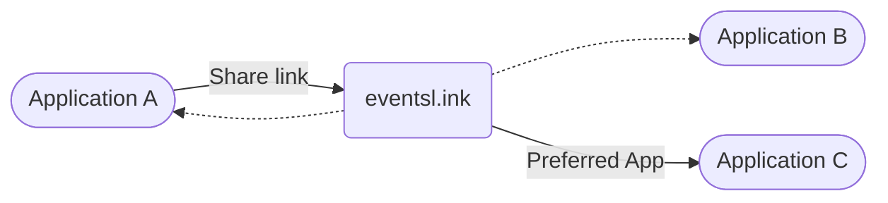

# eventsl.ink

Applications can use the `eventsl.ink` service to create links that open in compatible applications. This allows users to share events across different platforms while maintaining a consistent experience.

## Link Format

The links are path-based with query parameters for intent parsing. The base URL is `https://eventsl.ink`.

- Show an event: `/event` or `/e`

Search parameters for event links:

- One of the following:
  - `at`: an AT Protocol event record URI
  - `url`: an HTTP URL pointing to a JSON event payload
  - `data`: inline JSON event data

Examples:

- https://eventsl.ink/e?at=at://did:plc:example/community.lexicon.calendar.event/3kxyz
- https://eventsl.ink/event?url=https%3A%2F%2Fdeniz.blue%2Fevents-data%2Fevents%2F2026%2Ffoss%2Ffosdem26.json

